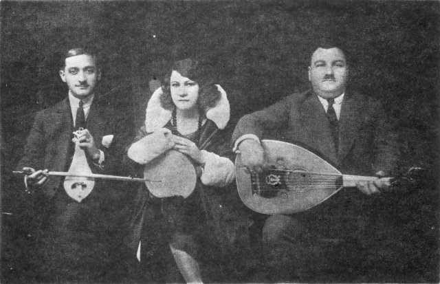

---
header-includes:
  <script src="https://unpkg.com/codemirror/lib/codemirror.js"></script>
  <link rel="stylesheet" href="https://unpkg.com/codemirror/lib/codemirror.css" />
  <script src="https://unpkg.com/codemirror/mode/javascript/javascript.js"></script>
  <script src="https://unpkg.com/codemirror/addon/mode/simple.js"></script>
  <script src="https://unpkg.com/codemirror/addon/runmode/runmode.js"></script>
  <script src="https://unpkg.com/codemirror/addon/display/autorefresh.js"></script>
  <script src="https://unpkg.com/codemirror/addon/edit/matchbrackets.js"></script>
  <script src="../highlight/makam-codemirror.js"></script>
  <script src="https://unpkg.com/makam-webui/makam-webui.js"></script>
  <link rel="stylesheet" href="slides.css" />
  <script type="text/javascript">var options = {}; options['makamLambdaURL'] = 'https://gj20qvg6wb.execute-api.us-east-1.amazonaws.com/icfp2018talk/makam/query'; options['stateBlocksEditable'] = true; options['autoRefresh'] = true; options['matchBrackets'] = true; options['urlOfDependency'] = (function(filename) { return new URL("../justcode/" + filename, document.baseURI).href; }); var webUI; document.addEventListener("DOMContentLoaded", function() { webUI = new LiterateWebUI(options); webUI.initialize(); });</script>
transition: fade
theme: custom
history: true
width: 800
height: 600
margin: 0.025
maxScale: 1
minScale: 1
pagetitle: Makam
---

# Prototyping a Functional Language <br /> using Higher-Order Logic Programming

<div style="margin-top: 1em;">
#### A Functional Pearl on Learning the Ways of λProlog/Makam
</div>

<div style="margin-top: 3em;">
Antonis Stampoulis (Originate NYC), Adam Chlipala (MIT CSAIL)
</div>

---

# PL research ideas: <br/> ability to experiment ↔ implementation time

---

# Metalanguages help minimize implementation time

<aside class="notes">
For example, PLT Redex and the K framework can be used to implement operational semantics quickly, Racket for implementing sophisticated DSLs, etc.
</aside>

---

# λProlog is good for prototyping advanced type systems

<div class="fragment" data-fragment-index="1">
- Concise and readable rules
- Very expressive
- Incremental definitions
</div>

---

# Example implemented in the paper

- Simply typed lambda calculus
- Multi-arity functions and letrec
- System F polymorphism
- Pattern matching
- Algebraic datatypes
- Type synonyms
- Heterogeneous metaprogramming
- Hindley-Milner generalization

---

# Also in the paper

- Complex binding structures
- GADT support in λProlog
- Structural recursion
- Use of reflective predicates

---



<div class="fragment" data-fragment-index="1">
<div style="position: absolute; top: 60px; left: 275px; color: black; font-weight: bold; font-size: 1.1em; background: rgba(255,255,255,0.8); width: 150px;">Roza<br/>(advisor)</div>
<div style="position: absolute; top: 40px; left: 480px; color: black; font-weight: bold; font-size: 1.1em; background: rgba(255,255,255,0.8); width: 150px;">Hagop<br/>(student)</div>
<div style="position: absolute; top: 400px; left: 75px; color: black; font-weight: bold; font-size: 0.9em; background: rgba(255,255,255,0.8); width: 200px;">Lambros<br/>from next door</div>
</div>

---

### Simply typed lambda calculus

---

```makam-hidden
tests : testsuite. %testsuite tests.
%use "00-adapted-stdlib.makam".
```

```makam-hidden
term : type.
typ : type.
typeof : term -> typ -> prop.

app : term -> term -> term.
lam : typ -> (term -> term) -> term.
arrow : typ -> typ -> typ.
```

$$\frac{\Gamma \vdash e_1 : \tau \to \tau' \hspace{1.0em} \Gamma \vdash e_2: \tau}{\Gamma \vdash e_1 \; e_2 : \tau'} \hspace{2em} \frac{\Gamma, x : \tau \vdash e : \tau'}{\Gamma \vdash \lambda x : \tau.e : \tau \to \tau'}$$

```makam
typeof (app E1 E2) T' :-
  typeof E1 (arrow T T'), typeof E2 T.

typeof (lam T X_E) (arrow T T') :-
  (x:term -> typeof x T -> typeof (X_E x) T').
```

---

```makam
typeof (lam _ (fun x => x)) T ?
```

---

```makam-noeval
term : type.
typ : type.
typeof : term -> typ -> prop.
```

---

$$t := t_1 t_2 \; | \; λx:\tau.t \\ \tau := \tau_1 \to \tau_2$$

```makam-noeval
app : term -> term -> term.
lam : typ -> (term -> term) -> term.
arrow : typ -> typ -> typ.
```

---

$$t := \texttt{app}(t_1, t_2) \; | \; \texttt{lam}(\tau, x.t) \\ \tau := \texttt{arrow}(\tau_1, \tau_2)$$

```makam-noeval
app : term -> term -> term.
lam : typ -> (term -> term) -> term.
arrow : typ -> typ -> typ.
```

---

### Multi-arity functions and let rec

---

$$t := \texttt{lammany}(\vec{xs}.t) \; | \; \texttt{appmany}(e, \vec{es}) \\ \tau := \texttt{arrowmany}(\vec{ts}, t)$$

<div class="fragment" data-fragment-index="1">
```makam
lammany : bindmany term term -> term.
appmany : term -> list term -> term.
arrowmany : list typ -> typ -> typ.
```
</div>

---

<!-- $$\frac{\Gamma, \vec{xs} : \vec{\tau{}s} \vdash e : \tau}{\Gamma \vdash \texttt{lammany}(\vec{xs}.e) : \vec{\tau{}s} \to \tau} \hspace{2em} \frac{\Gamma \vdash e : \vec{\tau{}s} \to \tau \hspace{1em} \forall i.\Gamma \vdash e_i : \tau_i}{\Gamma \vdash \texttt{appmany}(e, \vec{es})}$$ -->

```makam
typeof (lammany XS_E) (arrowmany TS T) :-
  openmany XS_E (pfun XS E =>
    assumemany typeof XS TS (typeof E T)).

typeof (appmany E ES) T :-
  typeof E (arrowmany TS T), map typeof ES TS.
```

---

$$t := \texttt{letrec}(\vec{xs}.(es, e))$$

```makam-noeval
letrec : bindmany term
           (list term * term) -> term.
```

---

$$t := \texttt{letrec}(\vec{xs}.(es, e))$$

```makam
letrec : vbindmany term N
           (vector term N * term) -> term.
```

---

```makam
typeof (letrec XS_DefsBody) T' :-
  vopenmany XS_DefsBody (pfun XS (Defs, Body) =>
    vassumemany typeof XS TS (vmap typeof Defs TS),
    vassumemany typeof XS TS (typeof Body T')).
```

---

### ML-style generalization

<p class="verse">
``We mentioned Hindley-Milner / we don't want you to be sad. <br />
This talk is very short I feel, / I hope it isn't bad. <br />
Please come and find me afterwards / to talk about these things,<br />
or if you'd like to learn about / the songs that Roza sings.''
</p>

---

```makam-hidden
generalize : (Type: typ) (GeneralizedType: typ) -> prop.
let : term -> (term -> term) -> term.
get_types_in_environment : [A] A -> prop.
tforall : (typ -> typ) -> typ.

get_types_in_environment Gamma :-
  refl.assume_get typeof Gamma.
```

$$\frac{\Gamma \vdash e : \tau \hspace{1em} \Gamma \vdash \tau \leadsto \tau_{gen} \hspace{1em} \Gamma, x : \tau_{gen} \vdash e' : \tau'}{\Gamma \vdash \text{let} \; x = e \; \text{in} \; e' : \tau'}$$

```makam
typeof (let E X_Body) T' :-
  typeof E T,
  generalize T Tgen,
  (x:term -> typeof x Tgen -> typeof (X_Body x) T').
```

---

$$\frac{\vec{\alpha} = \text{fv}(\tau) - \text{fv}(\Gamma)}{\Gamma \vdash \tau \leadsto \forall \vec{\alpha}.\tau}$$

---

```makam
generalize T T :-
  not(findunif T (A: typ)).

generalize T Res :-
  findunif T A,
  get_types_in_environment GammaTypes,
  (a:typ ->
    (replaceunif A a T (T' a),
     generalize (T' a) (T'' a))),
  if (hasunif A GammaTypes)
  then (eq Res (T'' A))
  else (eq Res (tforall T'')).
```

---

```makam-noeval
replaceunif Which ToWhat Where ToWhat :-
  refl.isunif Where,
  refl.sameunif Which Where.

replaceunif Which ToWhat Where Where :-
  refl.isunif Where,
  not(refl.sameunif Which Where).

replaceunif Which ToWhat Where Result :-
  not(refl.isunif Where),
  structural_recursion @(replaceunif Which ToWhat)
    Where Result.
```

---

```makam
typeof (let (lam _ (fun x => x)) (fun id => id)) T ?
```

---

## Thank you!

---

---

# Additional slides

---

## Tests:

```makam-hidden
>> typeof (lam _ (fun x => x)) T ?
>> Yes:
>> T := arrow T1 T1.
```

```makam-hidden
>> typeof (lam _ (fun x => app x x)) T ?
>> Impossible.
```

```makam-hidden
typeof (lammany (bind (fun x => bind (fun y => body (app y x))))) T ?
>> Yes:
>> T := arrowmany [T_X, arrow T_X T_Y] T_Y.
```

```makam-hidden
typeof (letrec (vbind (fun f => vbody (vcons (lam _ (fun x => app f x)) vnil, f)))) T ?
>> Yes:
>> T := arrow T1 T2.
```

```makam-hidden
>> generalize (arrow T T) X ?
>> Yes:
>> X := tforall (fun a => arrow a a).
```

```makam-hidden
>> typeof (let (lam _ (fun x => x)) (fun id => id)) T ?
>> Yes:
>> T := tforall (fun a => arrow a a).
```

```makam-hidden
>> typeof (let (lam _ (fun x => let x (fun y => y))) (fun id => id)) T ?
>> Yes:
>> T := tforall (fun a => arrow a a).
```

```makam
run_tests X ?
```

---

## Free Input:

```makam-input
```
